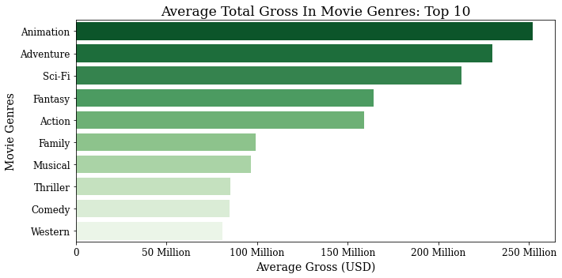
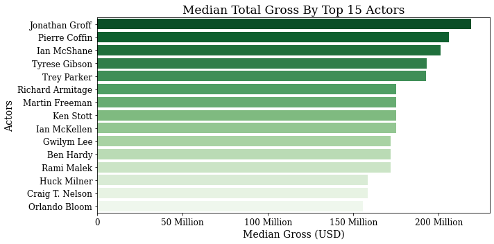
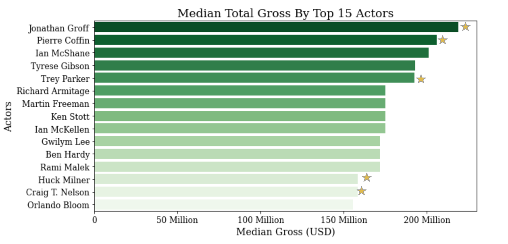
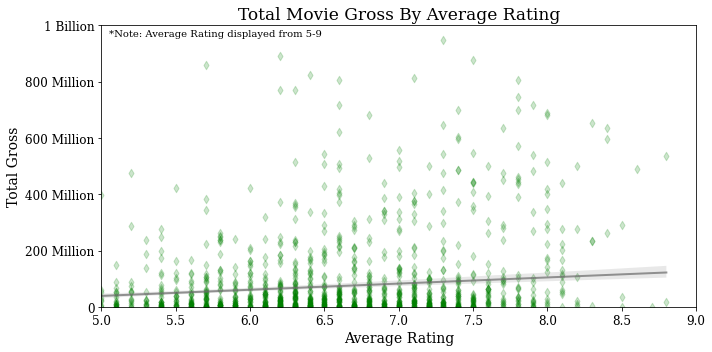

# Analyzing the Money: The Magic Behind The Movies


**Author**: [Rachel Sanderlin](mailto:sanderlin2013@gmail.com)

## Overview

In this project, we will be looking at movie datasets in order to give recommendations to Microsoft's new movie studio.

Entertainment is a huge, global market. According to [Forbes](https://www.forbes.com/sites/rosaescandon/2020/03/12/the-film-industry-made-a-record-breaking-100-billion-last-year/?sh=5404bc6634cd), the film industry made over 100 billion dollars in 2019. While that is a significant chunk of change, there is also a significant overhead in creating entertainment content. It is important for fledgling movie studios to research what type of content does well, so that they can use information from previous successes as a guide to replicate that success. As Microsoft is interested in making movies, the following project will focus on that component of the entertainment industry.

## Business Problem

While movies can be highly profitable, they are often expensive to produce. As such, it is important for Microsoft to look into what does- or does not- lead to financially successful movies. Analyzing movie success is complex, so this project has choosen a few elements to focus on. 

### Business Questions

The specific questions that this project focuses on are as follows: 
- Do certain genres result in higher grossing films?
- Is there a relationship between specific actors and higher grossing films?
- Do movies with higher average ratings result in higher grossing films?

## Data 

In order to glean information relevant to movie-making we will be looking at two datasets from [IMDB](https://www.imdb.com/) and [Box Office Mojo](https://www.boxofficemojo.com/). 

- IMDB stands for Internet Movie Database and is one of the most popular and comprehensive internet sources for movie and entertainment data. The dataset we are working with focuses on information about movies - the producers, the genres, the actors, the movies ratings, ect. 

- Box Office Mojo is a site that tracks box-office revenue, and the data set we will be using from them contains this information. 

By using these two datasets together, we can extract if certain aspects of a movie lead to higher box-office revenue, which is an industry standard for movie success. 

**Limitations** 

This data is only on movies, thus it can not be extrapolated to the entire entertainment industry. Additionally, as the dataset only contains the total gross, it will not include the costs of creating the movies. Finally, the dataset only looks at box office revenue, which means that the total revenue (from streaming sites or other sources) may be higher. 

## Method

This project uses descriptive analysis in order to find useful movie industry business recommendations.

## Results

### Do certain genres result in higher grossing films?
Based on the graph below, we see that there are genres that have on average higher grossing films

 
 
 ### Is there a relationship between specific actors and higher grossing films?
  At a glance, we do see that there is a significant difference between the median gross of films with different actors. Surprisingly, there are only a few household names in the final 15. This may relate back to our previous finding, which is that animated films are the highest grossing movie genre. In animated films, one doesn't see the actors' faces, and as such may be more 'anonymous' and unknown to the average movie watcher. On a separate note, it is surprising that this list is composed only of men.
  
 
 
Before, the analysis seemed to indicate that animated films are a direction for Microsoft's new movie studio to check out. Let's see if any of the top 15 actors were involved in animated films.
 
 
 
### Do movies with higher average ratings result in higher grossing films?
Based on the graph below, it doesn't seem like there is a strong correlation between the average ratings and the total gross. This is confirmed when we check Pearson's correlation (.23) which is not signifigant. 

 
 
 ## Conclusions
 
In summation, the three recommendations coming out of this analysis are:

 - The data indicates that there are specific genres that in the past have (on average) done very well. In particular, animation seems to have high on-average box office returns. As such, I would recommend that Microsoft focus its initial film-making energies on animated films, with co-genres of adventure, scifi, and fantasy.
- There are actors that have a high median total foreign gross. These actors should be further analyzed when the movie making process is farther along to see if they would be a good fit in any of the initial films. It should be noted that 5/15 of the actors (33.3%) have worked on at least one animation film, and as such these actors should especially considered for possible future films at Microsoft's studio.
- Finally, it seems that there is no significant correlation between film ratings and box office success - as such it is important to note that the quality of the movie has little to no bearing on a movie's box office success. In short, it's okay to skimp on film quality to a certain extent.

### Next Steps

- Further analysis on what actors would be best to have in films with weighted analysis based on genre.
- Incorporate expanded data sets that include production costs of films as well as forms of movie revenue beyond box-office gross. Specifically analyze production costs by genre.
- Look into what type of animated films do well.

## For More Information
See the full analysis in the [Jupyter Notebook](/Movie Data Analysis.ipynb) or review this [presentation](/Phase1_Slideshow.pdf).

For additional info, contact Rachel Sanderlin at [sanderlin2013@gmail.com](mailto:sanderlin2013@gmail.com)

## Repository Structure

```
├── Images
├── zipped_data
├──.gitignore
├── Movie Data Analysis.ipynb
├── Phase1_Slideshow.pdf
├── Phase1_jupyter_notebook.pdf
├── README.md
└── requirements.txt
```
